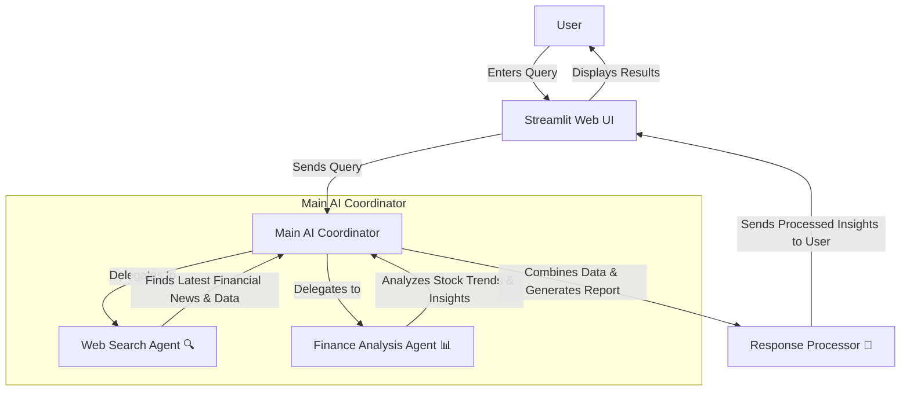

# 📈 Financial Agent

## 🌟 Overview

The **Financial Agent** is an AI-powered tool designed to assist users with financial research and analysis. It helps users gather **real-time stock data**, **market insights**, and **financial news** using advanced AI models.

## 🚀 Features

- 🔍 **Web Search** – Retrieves the latest financial news from the web.
- 📊 **Finance Analysis** – Provides stock price trends, analyst recommendations, and financial data.
- 🖥️ **User-Friendly Interface** – Built using **Streamlit** for an interactive experience.
- 📚 **Multi-Agent System** – Uses specialized AI agents for different tasks to improve accuracy.
- ⚠️ **Robust Error Handling** – Logs issues using Python’s `logging` module and provides user-friendly warnings.

---

## ❓ Why Multi-Agent?

Traditional financial research requires navigating **multiple sources**, which can be time-consuming. This project **automates financial insights** using an AI-driven multi-agent system:

- ✅ **Automates Web Search** → Finds relevant financial news.
- ✅ **Performs Stock Analysis** → Retrieves real-time stock data and trends.
- ✅ **AI Coordination** → Combines insights into structured, easy-to-read reports.

### **Multi-Agent System Breakdown**

- 🔍 **Web_Search_Agent** → Searches the latest finance news.
- 📊 **Finance_Analysis_Agent** → Fetches stock data and fundamentals.
- 🏆 **Finance_Team_Agent** → Combines results and presents a final, **clear** answer.

---

### **Example Workflow**

A user asks: _"What is the latest update on Tesla stock?"_

🚀 **Financial Agent**:  
1️⃣ **Fetches Tesla’s latest stock price & trends** 📈  
2️⃣ **Searches for recent Tesla-related financial news** 🔍  
3️⃣ **Summarizes insights with AI** 🏆

---

## 🛠️ Technologies Used

- **[Agno](https://agno.com/)** – Advanced AI modeling
- **[DuckDuckGo API](https://duckduckgo.com/)** – Web search for finance news
- **[YFinanceTools](https://pypi.org/project/yfinance/)** – Stock market data
- **[Streamlit](https://streamlit.io/)** – Interactive UI
- **Python-dotenv** – Environment variable management
- **Logging** – Built-in Python `logging` for error handling and debugging

---

## 🏗️ System Architecture

This diagram shows how the **Financial Agent** processes user queries using multiple AI agents.



## Installation

1. **Clone the Repository**:
   ```bash
   git clone https://github.com/deepakmalikk/Financial_Agent.git
   cd Financial_Agent
   ```
2. **Set Up Environment Variables**:

   ```bash
   OPENAI_API_KEY=your_openai_api_key_here
   ANTHROPIC_API_KEY =your_anthropic_api_key_here

   ```

3. **Install Dependencies**:

   ```bash
   pip install -r requirements.txt

   ```

4. **Run the Application**:
   ```bash
   streamlit run src/financial_agent.py
   ```

## 🖥️ Usage

- Open the app in your browser.
- Enter a financial question (e.g., "Latest news on Tesla stock").
- Click “Get Financial Insights” – The AI will fetch results.
- View insights including stock prices, news, and analysis.

## 🚀 Deployment

🔗 Live Demo: [https://financialagent01.streamlit.app/]

## 🤝 Contributing

🙌 Contributions are welcome! Follow these steps to contribute:

1. Fork the repository
2. Create a new branch:

```bash
git checkout -b feature-branch
```

3. Make your changes
4. Commit your changes:

```bash
git commit -m "Added a new feature"
```

5. Push to GitHub:

```bash
  git push origin feature-branch
```

6. Create a pull request 🚀

## 📜 License

This project is licensed under the MIT License – see the LICENSE file for details.
